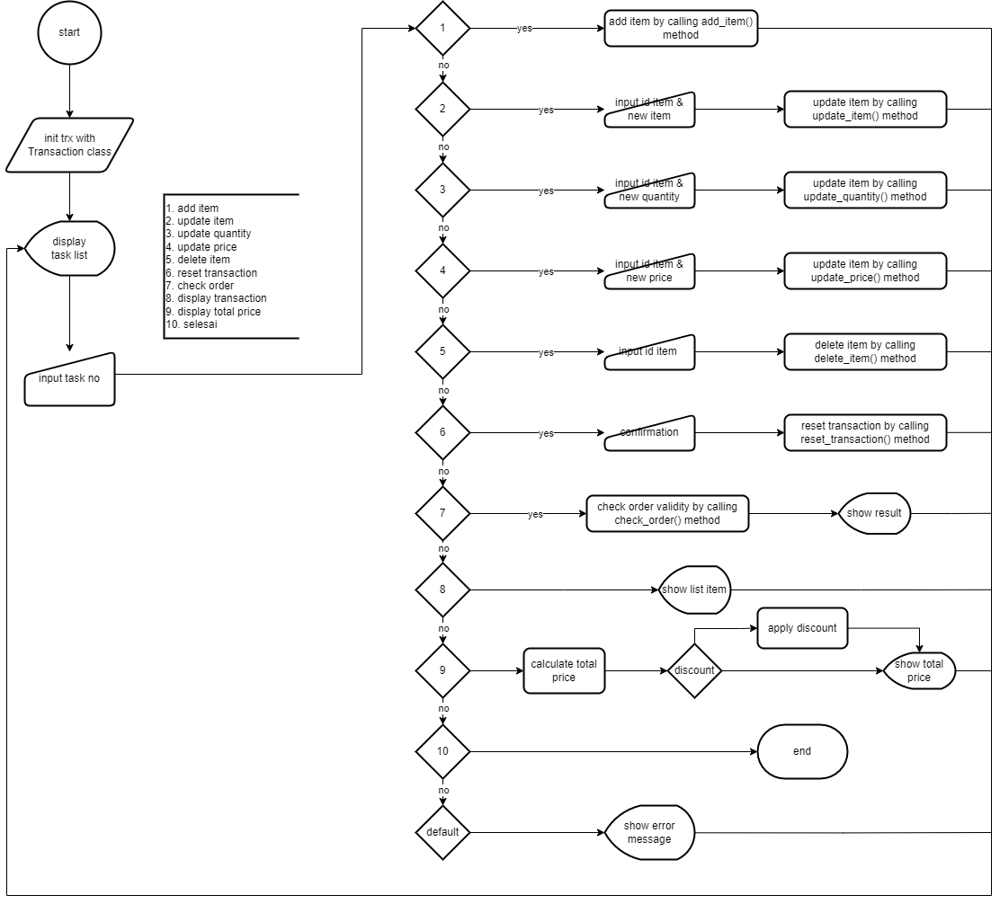
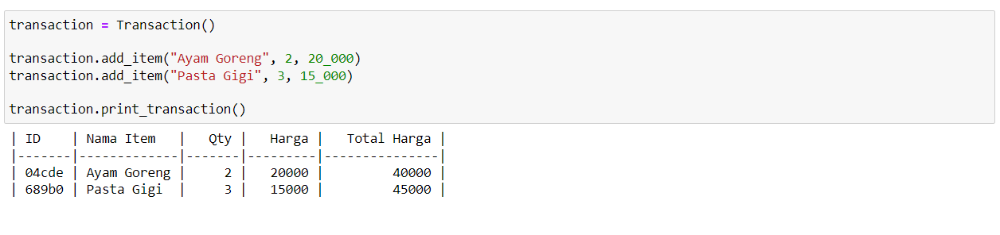
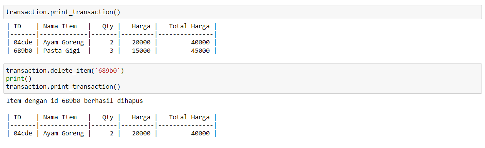
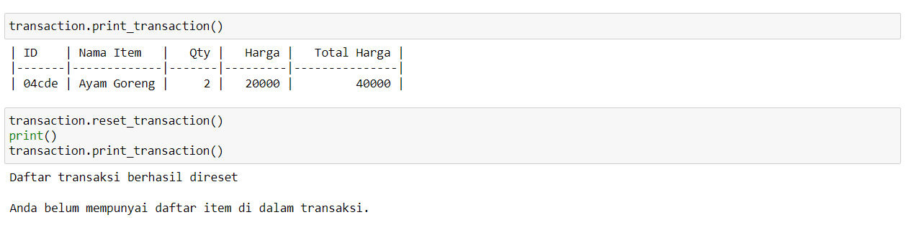
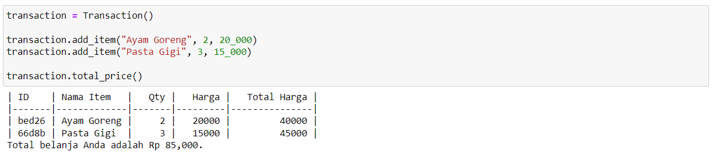
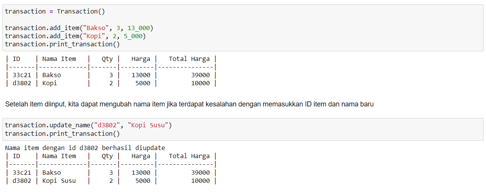
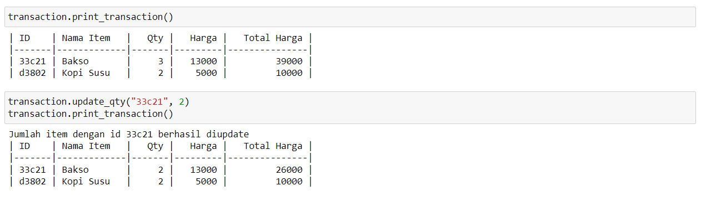
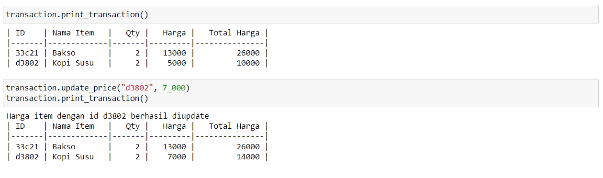
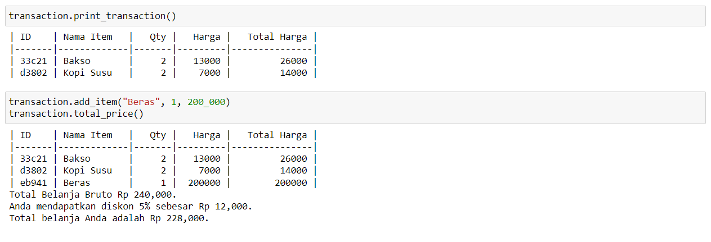
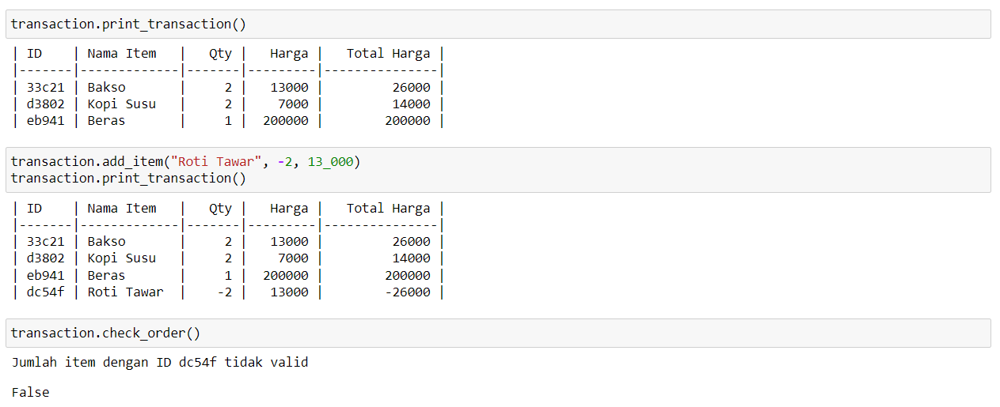

# Super Cashier

Super Cashier merupakan sebuah program self-service cashier yang dapat memudahkan pelanggan dalam melakukan transaksi. Pelanggan dapat memasukkan data item, jumlah item dan harga item yang dibeli secara mandiri.

## Objectives

Membuat sebuah program kasir yang dapat menjalankan tugas sebagai berikut:
 - Pengguna dapat memasukkan data transaksi: nama item, jumlah item dan harga item yang dibeli
 - Pengguna dapat mengubah nama item dari data yang sudah dimasukkan
 - Pengguna dapat mengubah jumlah item dari data yang sudah dimasukkan
 - Pengguna dapat mengubah harga item dari data yang sudah dimasukkan
 - Pengguna dapat menghapus data yang sudah dimasukkan
 - Pengguna dapat mereset daftar data transaksi yang dimasukkan
 - Pengguna dapat melakukan pemeriksaan terhadap daftar data transaksi untuk memastikan input data sudah benar, terdapat pesan hasil pemeriksaan
 - Pengguna dapat melihat daftar data transaksi yang sudah dimasukkan
 - Pengguna dapat menghitung total harga dari daftar data transaksi yang sudah dimasukkan
 - Pengguna mendapatkan diskon dengan ketentuan berikut:
    - 5% untuk total transaksi diatas Rp. 200.000
    - 8% untuk total transaksi diatas Rp. 300.000
    - 10% untuk total transaksi diatas Rp. 500.000

## Alur Program / Flow Chart

Berikut alur program sistem dari awal ketika pertama kali dijalankan hingga akhir ketika program dimatikan. Terdapat beberapa menu yang dapat dipilih oleh pengguna dimana kemudian sistem akan menjalankan perintah yang dipilih.



## Penjelasan Function / Method

Berikut penjelasan mengenai setiap method yang ada di dalam class `Transaction`.
 - **Constructor function**

```python
class Transaction():

    def __init__(self) -> None:
        # inisiasi instance attribute
        self.trx = dict()
        self.is_valid = False
```

 - Method untuk **menambahkan item baru**

```python
def add_item(self, name: str, qty: int, price: float) -> None:
    '''Fungsi untuk menambahkan item baru ke dalam transaksi.
    name (str) = nama item yang dibeli
    qty (int) = jumlah item yang dibeli
    price (float) = harga per item'''

    # pengecekan validitas input
    err_message = []
    if type(name) != str:
        err_message.append('Item harus bertipe string')
    if type(qty) != int:
        err_message.append('Qty harus bertipe integer')
    if type(price) != float and type(price) != int:
        err_message.append('Price harus bertipe float atau integer')
    
    # menampilkan pesan error jika terjadi kesalahan
    if len(err_message) > 0:
        print("\n".join(err_message))
        return

    # membuat unique ID untuk item baru
    new_id = uuid.uuid4().hex
    id_item = new_id[:5]

    # memasukkan data item baru ke dictionary transaksi
    new_item = {
        id_item: [id_item, name, qty, price, qty*price]
    }
    self.trx.update(new_item)
```

 - Method untuk **menghapus item**

```python
def delete_item(self, id_item: str) -> None:
    '''Fungsi untuk menghapus data nama item beserta jumlah dan harganya dari transaksi.
    id_item (str) = id item yang ingin dihapus'''

    # pengecekan validitas ID
    err_message = []
    if type(id_item) != str:
        err_message.append('ID harus bertipe string')
    
    # menampilkan pesan error jika terjadi kesalahan
    if len(err_message) > 0:
        print("\n".join(err_message))
        return

    # melakukan pengecekan apakah item dengan ID tersebut tersedia di dalam daftar transaksi
    if id_item not in self.trx:
        print('ID tidak ditemukan dalam daftar belanja Anda')
        return

    # melakukan penghapusan item dari daftar transaksi
    self.trx.pop(id_item)

    # menampilkan pesan
    print(f'Item dengan id {id_item} berhasil dihapus')
```

 - Method untuk **menghapus seluruh item** di dalam transaksi

```python
def reset_transaction(self) -> None:
    '''Fungsi untuk menghapus semua data pesanan dalam transaksi.'''
    
    # melakukan penghapusan seluruh isi di dalam transaksi
    self.trx.clear()

    # menampilkan pesan
    print('Daftar transaksi berhasil direset')
```

 - Method untuk **mengupdate nama** item di dalam transaksi

```python
def update_name(self, id_item: str, new_name: str) -> None:
    '''Fungsi untuk mengubah nama item yang sudah diinput ke dalam transaksi.
    id_item (str) = id item yang namanya ingin diganti
    new_name (str) = nama baru untuk item yang diganti'''
    
    # pengecekan validitas input ID dan nama item baru
    err_message = []
    if type(new_name) != str:
        err_message.append('Item harus bertipe string')
    if type(id_item) != str:
        err_message.append('ID harus bertipe string')
    
    # menampilkan pesan error jika terjadi kesalahan
    if len(err_message) > 0:
        print("\n".join(err_message))
        return

    # melakukan pengecekan apakah item dengan ID tersebut tersedia di dalam daftar transaksi
    if id_item not in self.trx:
        print('ID tidak ditemukan dalam daftar belanja Anda')
        return

    # assign nama item baru sesuai dengan ID
    self.trx[id_item][1] = new_name

    # menampilkan pesan
    print(f'Nama item dengan id {id_item} berhasil diupdate')
```

 - Method untuk **mengupdate jumlah** item di dalam transaksi

```python
def update_qty(self, id_item: str, new_qty: int) -> None:
    '''Fungsi untuk mengubah jumlah item yang sudah diinput ke dalam transaksi.
    id_item (str) = id item yang jumlahnya ingin diganti
    new_qty (int) = jumlah baru untuk item yang diganti'''

    # pengecekan validitas input ID dan jumlah item baru
    err_message = []
    if type(new_qty) != int:
        err_message.append('Qty harus bertipe integer')
    if type(id_item) != str:
        err_message.append('ID harus bertipe string')
    
    # menampilkan pesan error jika terjadi kesalahan
    if len(err_message) > 0:
        print("\n".join(err_message))
        return

    # melakukan pengecekan apakah item dengan ID tersebut tersedia di dalam daftar transaksi
    if id_item not in self.trx:
        print('ID tidak ditemukan dalam daftar belanja Anda')
        return

    # assign jumlah item baru sesuai dengan ID
    self.trx[id_item][2] = new_qty

    # melakukan perhitungan total harga sesuai dengan jumlah item baru
    self.trx[id_item][4] = new_qty * self.trx[id_item][3]

    # menampilkan pesan
    print(f'Jumlah item dengan id {id_item} berhasil diupdate')
```

 - Method untuk **mengupdate harga** item di dalam transaksi

```python
def update_price(self, id_item: str, new_price: float) -> None:
    '''Fungsi untuk mengubah harga per item yang sudah diinput ke dalam transaksi.
    id_item (str) = id item yang harganya ingin diganti
    new_price (float) = harga baru untuk item yang diganti'''

    # pengecekan validitas input ID dan harga item baru
    err_message = []
    if type(new_price) != float and type(new_price) != int:
        err_message.append('Price harus bertipe float atau integer')
    if type(id_item) != str:
        err_message.append('ID harus bertipe string')
    
    # menampilkan pesan error jika terjadi kesalahan
    if len(err_message) > 0:
        print("\n".join(err_message))
        return

    # melakukan pengecekan apakah item dengan ID tersebut tersedia di dalam daftar transaksi
    if id_item not in self.trx:
        print('ID tidak ditemukan dalam daftar belanja Anda')
        return

    # assign harga per item baru sesuai dengan ID
    self.trx[id_item][3] = new_price

    # melakukan perhitungan total harga sesuai dengan harga per item baru
    self.trx[id_item][4] = self.trx[id_item][2] * new_price

    # menampilkan pesan
    print(f'Harga item dengan id {id_item} berhasil diupdate')
```

 - Method untuk **menampilkan daftar item** di dalam transaksi

```python
def print_transaction(self) -> None:
    '''Fungsi untuk menampilkan semua pesanan dalam transaksi.'''
    
    # pengecekan apakah terdapat transaksi
    if len(self.trx) <= 0:
        print('Anda belum mempunyai daftar item di dalam transaksi.')
        return

    # mengubah data dictionary transaksi menjadi dataframe
    trx_table = pd.DataFrame(self.trx).T

    # menampilkan daftar transaksi dalam bentuk tabel
    headers = ["ID", "Nama Item", "Qty", "Harga", "Total Harga"]
    print(tabulate(trx_table, headers, tablefmt="github", showindex=False))
```

 - Method untuk **mengecek validitas** seluruh item di dalam transaksi

```python
def check_order(self) -> bool:
    '''Fungsi untuk cek validitas dan menampilkan pesan kesalahan jika terdapat data yang tidak valid.'''

    # pengecekan apakah terdapat transaksi
    if len(self.trx) <= 0:
        print('Anda belum mempunyai daftar item di dalam transaksi.')
        return
    
    # melakukan pengecekan validitas setiap item di dalam transaksi
    err_message = []
    for id, item in self.trx.items():
        if len(item[1]) <= 0:
            err_message.append(f'Nama item dengan ID {id} tidak valid')
        if item[2] <= 0:
            err_message.append(f'Jumlah item dengan ID {id} tidak valid')
        if item[3] <= 0:
            err_message.append(f'Harga item dengan ID {id} tidak valid')
        
    # menampilkan pesan error jika terdapat data item yang tidak valid
    if len(err_message) > 0:
        self.is_valid = False
        print("\n".join(err_message))
    else:
        self.is_valid = True

    return self.is_valid
```

 - Method untuk **mengecek total transaksi dan discount**

```python
def total_price(self) -> None:
    '''Fungsi untuk menampilkan total belanja.'''

    # memeriksa apakah ada item di dalam transaksi
    if len(self.trx) <= 0:
        print('Anda belum mempunyai daftar item di dalam transaksi.')
        return

    # memastikan daftar transksi sudah valid
    if not self.check_order():
        print('Transaksi tidak valid, silahkan diupdate terlebih dahulu')
        return

    # menampilkan daftar transaksi
    self.print_transaction()
    
    # menghitung total transaksi
    grand_total = 0
    for item in self.trx.values():
        grand_total += item[4]
    
    # menghitung diskon
    if grand_total > 500_000:
        discount = float(grand_total * 0.1) # 10%
        grand_total = float(grand_total - discount)
        print(f"Anda mendapatkan diskon 10% sebesar Rp {discount:,}. Total belanja Anda adalah Rp {grand_total:,}.")
    
    elif grand_total > 300_000:
        discount = int(grand_total*0.08) # 8%
        grand_total = int(grand_total-discount)
        print(f"Anda mendapatkan diskon 8% sebesar Rp {discount:,}. Total belanja Anda adalah Rp {grand_total:,}.")
    
    elif grand_total > 200_000:
        discount = int(grand_total*0.05) # 5%
        grand_total = int(grand_total-discount)
        print(f"Anda mendapatkan diskon 5% sebesar Rp {discount:,}. Total belanja Anda adalah Rp {grand_total:,}.")
    
    else:
        print(f"Total belanja Anda adalah Rp {grand_total:,}.")
```

## Test Case

Berikut adalah hasil test yang telah dilakukan sesuai dengan test case yang diberikan

### Test Case 1: Menambahkan Item

Menambahkan dua item baru menggunakan method `add_item()`. Item yang ditambahkan sebagai berikut:
- Nama item: Ayam Goreng, Qty: 2, Harga: 20000
- Nama item: Pasta Gigi, Qty: 3, Harga: 15000



### Test Case 2: Menghapus Item

Menghapus item menggunakan method `delete_item()`. Item yang dihapus adalah Pasta Gigi.



### Test Case 3: Reset Transaksi

Mereset transaksi menggunakan method `reset_transaction()`.



### Test Case 4: Menghitung Total Belanja

Menghitung total belanja menggunakan method `total_price()`. Sebelum mengeluarkan output total belanja, akan menampilkan item-item yang dibeli.



### Test Case 5: Mengupdate Nama Item

Mengubah nama item yang sudah diinput ke dalam transaksi menggunakan method `update_name()`.



## Test Case 6: Mengupdate Jumlah Item

Mengubah jumlah item yang sudah diinput ke dalam transaksi menggunakan method `update_qty()`.



## Test Case 7: Mengupdate Harga Item

Mengubah harga item yang sudah diinput ke dalam transaksi menggunakan method `update_price()`.



## Test Case 8: Menghitung Total Belanja dan Diskon

Menghitung total belanja menggunakan method total_price(). Sebelum mengeluarkan output total belanja, akan menampilkan item-item yang dibeli. Sistem akan menampilkan diskon dengan ketentuan
 - 5% untuk total transaksi diatas Rp. 200.000
 - 8% untuk total transaksi diatas Rp. 300.000
 - 10% untuk total transaksi diatas Rp. 500.000



## Test Case 9: Terdapat Kesalahan Input Saat Check Order

Sistem akan menampilkan pesan kesalahan saat pengecekan order jika ada kesalahan input



## Conclusion

Sistem Super Cashier berhasil dikembangkan dan telah melewati beberapa test case yang diberikan dengan hasil yang sudah sesuai.